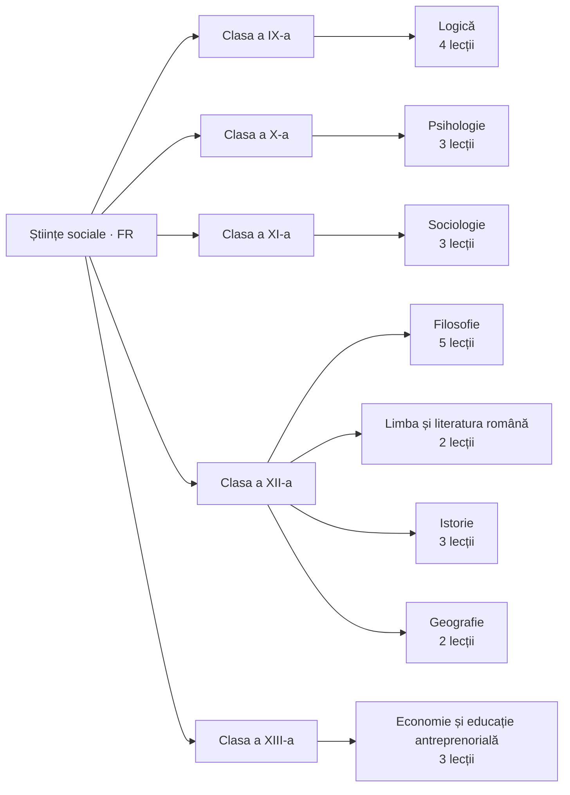

---
tags:
  - moc
cssclasses: harta
---
# Hartă de învățare

Unde stă fiecare materie cu conținut în cei cinci ani.

## Ordinea recomandată

1. [[Filosofie]] — [[Clasa a XII-a]]
2. [[Logică, argumentare și comunicare]] — [[Clasa a IX-a]]
3. [[Psihologie]] — [[Clasa a X-a]]
4. [[Sociologie]] — [[Clasa a XI-a]]
5. [[Economie și educație antreprenorială]] — [[Clasa a XIII-a]]
6. [[Limba și literatura română]] — [[Clasa a XII-a]]
7. [[Istorie]] — [[Clasa a XII-a]]
8. [[Geografie]] — [[Clasa a XII-a]]

Înapoi la [[00 Start aici]]
