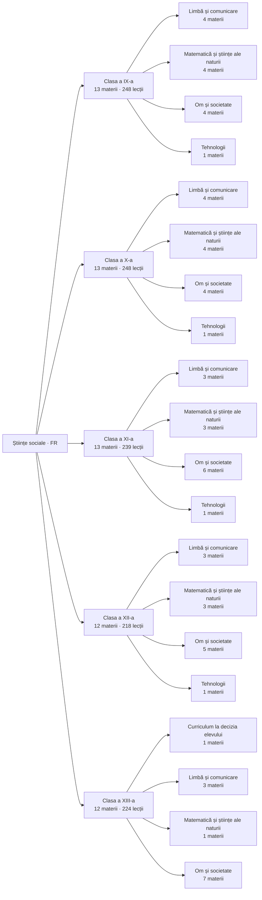

---
tags:
  - moc
cssclasses: harta
---
# Hartă de învățare

Unde stă fiecare materie cu conținut în cei cinci ani.

## Ordinea recomandată

### [[Clasa a IX-a]]

- [[Geografie (clasa a IX-a)|Geografie]] — 20 lecții
- [[Istorie (clasa a IX-a)|Istorie]] — 24 lecții
- [[Logică, argumentare și comunicare (clasa a IX-a)|Logică, argumentare și comunicare]] — 24 lecții
- [[Religie (clasa a IX-a)|Religie]] — 18 lecții
- [[Limba latină (clasa a IX-a)|Limba latină]] — 18 lecții
- [[Limba modernă 1 (Engleză) (clasa a IX-a)|Limba modernă 1 (Engleză)]] — 18 lecții
- [[Limba modernă 2 (Franceză) (clasa a IX-a)|Limba modernă 2 (Franceză)]] — 18 lecții
- [[Limba și literatura română (clasa a IX-a)|Limba și literatura română]] — 20 lecții
- [[Biologie (clasa a IX-a)|Biologie]] — 18 lecții
- [[Chimie (clasa a IX-a)|Chimie]] — 18 lecții
- [[Fizică (clasa a IX-a)|Fizică]] — 18 lecții
- [[Matematică (clasa a IX-a)|Matematică]] — 18 lecții
- [[Tehnologia informației și a comunicațiilor (TIC) (clasa a IX-a)|Tehnologia informației și a comunicațiilor (TIC)]] — 16 lecții

### [[Clasa a X-a]]

- [[Geografie (clasa a X-a)|Geografie]] — 20 lecții
- [[Istorie (clasa a X-a)|Istorie]] — 24 lecții
- [[Psihologie (clasa a X-a)|Psihologie]] — 24 lecții
- [[Religie (clasa a X-a)|Religie]] — 18 lecții
- [[Limba latină (clasa a X-a)|Limba latină]] — 18 lecții
- [[Limba modernă 1 (Engleză) (clasa a X-a)|Limba modernă 1 (Engleză)]] — 18 lecții
- [[Limba modernă 2 (Franceză) (clasa a X-a)|Limba modernă 2 (Franceză)]] — 18 lecții
- [[Limba și literatura română (clasa a X-a)|Limba și literatura română]] — 20 lecții
- [[Biologie (clasa a X-a)|Biologie]] — 18 lecții
- [[Chimie (clasa a X-a)|Chimie]] — 18 lecții
- [[Fizică (clasa a X-a)|Fizică]] — 18 lecții
- [[Matematică (clasa a X-a)|Matematică]] — 18 lecții
- [[Tehnologia informației și a comunicațiilor (TIC) (clasa a X-a)|Tehnologia informației și a comunicațiilor (TIC)]] — 16 lecții

### [[Clasa a XI-a]]

- [[Geografie (clasa a XI-a)|Geografie]] — 20 lecții
- [[Istoria evreilor. Holocaustul (clasa a XI-a)|Istoria evreilor. Holocaustul]] — 18 lecții
- [[Istorie (clasa a XI-a)|Istorie]] — 24 lecții
- [[Religie (clasa a XI-a)|Religie]] — 18 lecții
- [[Sociologie (clasa a XI-a)|Sociologie]] — 24 lecții
- [[Studii sociale (clasa a XI-a)|Studii sociale]] — 18 lecții
- [[Limba modernă 1 (Engleză) (clasa a XI-a)|Limba modernă 1 (Engleză)]] — 18 lecții
- [[Limba modernă 2 (Franceză) (clasa a XI-a)|Limba modernă 2 (Franceză)]] — 18 lecții
- [[Limba și literatura română (clasa a XI-a)|Limba și literatura română]] — 20 lecții
- [[Biologie (clasa a XI-a)|Biologie]] — 11 lecții
- [[Matematică aplicată în științele sociale (clasa a XI-a)|Matematică aplicată în științele sociale]] — 18 lecții
- [[ȘTIAM (științe integrate) (clasa a XI-a)|ȘTIAM (științe integrate)]] — 16 lecții
- [[Tehnologia informației și a comunicațiilor (TIC) (clasa a XI-a)|Tehnologia informației și a comunicațiilor (TIC)]] — 16 lecții

### [[Clasa a XII-a]]

- [[Filosofie (clasa a XII-a)|Filosofie]] — 24 lecții
- [[Geografie (clasa a XII-a)|Geografie]] — 20 lecții
- [[Istorie (clasa a XII-a)|Istorie]] — 24 lecții
- [[Religie (clasa a XII-a)|Religie]] — 18 lecții
- [[Studii sociale (clasa a XII-a)|Studii sociale]] — 18 lecții
- [[Limba modernă 1 (Engleză) (clasa a XII-a)|Limba modernă 1 (Engleză)]] — 18 lecții
- [[Limba modernă 2 (Franceză) (clasa a XII-a)|Limba modernă 2 (Franceză)]] — 18 lecții
- [[Limba și literatura română (clasa a XII-a)|Limba și literatura română]] — 20 lecții
- [[Biologie (clasa a XII-a)|Biologie]] — 8 lecții
- [[Matematică aplicată în științele sociale (clasa a XII-a)|Matematică aplicată în științele sociale]] — 18 lecții
- [[ȘTIAM (științe integrate) (clasa a XII-a)|ȘTIAM (științe integrate)]] — 16 lecții
- [[Tehnologia informației și a comunicațiilor (TIC) (clasa a XII-a)|Tehnologia informației și a comunicațiilor (TIC)]] — 16 lecții

### [[Clasa a XIII-a]]

- [[Economie și educație antreprenorială (clasa a XIII-a)|Economie și educație antreprenorială]] — 24 lecții
- [[Filosofie (clasa a XIII-a)|Filosofie]] — 22 lecții
- [[Geografie (clasa a XIII-a)|Geografie]] — 20 lecții
- [[Istoria comunismului din România (clasa a XIII-a)|Istoria comunismului din România]] — 18 lecții
- [[Istorie (clasa a XIII-a)|Istorie]] — 22 lecții
- [[Religie (clasa a XIII-a)|Religie]] — 18 lecții
- [[Studii sociale (clasa a XIII-a)|Studii sociale]] — 18 lecții
- [[Limba modernă 1 (Engleză) (clasa a XIII-a)|Limba modernă 1 (Engleză)]] — 18 lecții
- [[Limba modernă 2 (Franceză) (clasa a XIII-a)|Limba modernă 2 (Franceză)]] — 18 lecții
- [[Limba și literatura română (clasa a XIII-a)|Limba și literatura română]] — 20 lecții
- [[Biologie (clasa a XIII-a)|Biologie]] — 6 lecții
- [[Pregătire pentru bacalaureat (CDEOȘ) (clasa a XIII-a)|Pregătire pentru bacalaureat (CDEOȘ)]] — 20 lecții

Înapoi la [[00 Start aici]]
